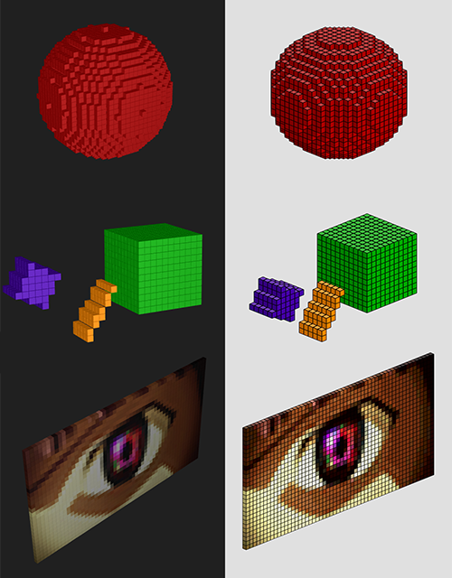

# Voxel Renderer

A voxel renderer library for HTML5, written in CoffeeScript with AMD modules.  

Can render in 3D using three.js, or in a pixel-art-style isometric view using pixi.js.

Scenes are composed using the already-familiar three.js API. See `/demo` source to get started.   

Easy-to-use and low-performant.

Work in progress. API and implementation may change. If using this library as the basis for a project, please clone or fork.

## Demo  

[View demo](http://www.google.com) 

  

## Demo project setup

Install grunt if necessary.  

CD to project root.  

Install node dependencies for grunt:   
`npm install` 

Run default grunt task:  
`grunt`

Deployed files will be compiled and copied to the `out` directory.

For browser source map support, point webserver to repo's base directory rather than `out` dir. 
  

## Possible todo's

#### Obvious

More primitives  

	implement `FastRect` and `FastBitmap`
	cylinder
	cone
	pyramid
	line
	circle
	3d-bitmap (for fonts, character animations, etc.) (maybe importing some ~standard voxel file format?)
	wireframe-looking cube
	
'Subtractive' objects

Mechanism for 'object overdraw precedence' (or at least formalize the rules describing how it currently behaves) 

#### Major

Off-load per-voxel hit tests with shader logic
 
Shader-based custom render routine, bypassing general-purpose graphics frameworks...

Objects mapped to 

